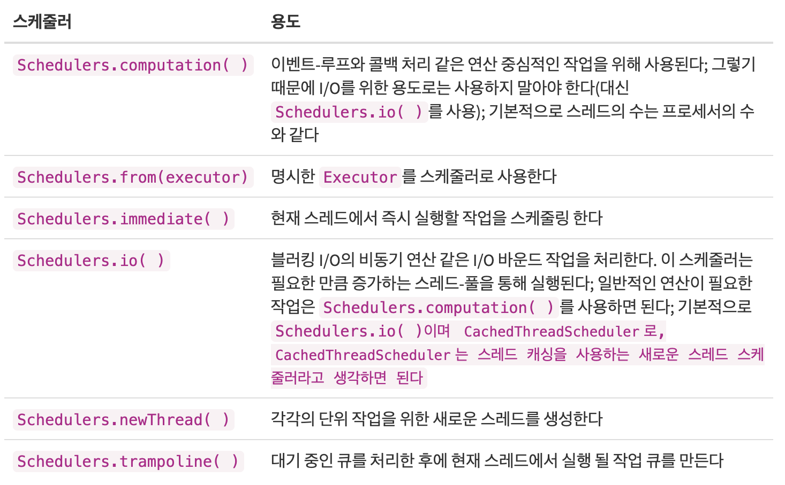

# Scheduler
## Scheduler에 대해서
- 기본적으로 Rx에서의 Observable 연산자를 이용하여 연산을 처리할때에는 싱글스레드 위에서 동작을 한다.
- 하지만 우리가 개발을 하다보면 멀티스레딩을 써야할때가 많다. 
- 예를 들어 백그라운드 스레드에선 네트워크 작업, 연산이 많은 작업을 해야하고, UI에 관련한 작업은 메인 스레드에서 해야 하듯이 말이다.
- Rx에선 일부 Observable 연산자는 사용할 스케줄러를 파라미터로 전달 받기도 하는데, 이를 통해서 연산 전체 혹은 일부를 전달받은 스케줄러에서 실행한다.
- 그럼 그 연산자들을 확인해보자.

## Marble Diagrams & Explain

### - observeOn
- observeOn 연산자는 observer가 어느 스레드에서 동작할지 정의한다.
- 간단하게 말하면 observeOn 연산자가 명시된 다음의 연산들은 observeOn에서 받은 스케줄러에서 작업한다.

### - subscribeOn
- subscribeOn 연산자는 Observable이 어느 스레드에서 동작할지 정의한다.
- 간단하게 말하면 Observable이 작업을 시작할 스레드를 전달 받는다.

## RxJava의 스케줄러들
- 아래는 공식 Rxdocumentaition에 나와있는 rxjava의 스케줄러이다.  

~~~java
// ex
public interface GithubApi {
  @GET("users/{owner}/repos")
  Single<List<GithubRepo>> getRepos(@Path("owner") String owner);
}

// retrofit client 부분 코드 생략

github = new GithubClient();
disposable = github.getApi().getRepos(OWNER)
    .subscribeOn(Schedulers.io())
    .observeOn(AndroidSchedulers.mainThread())
    .subscribe( items -> adapter.updateItems(items));
~~~
위 예제처럼 사용 가능함

## RxSwift의 스케줄러들

- CurrentThreadScheduler (시리얼) : 특정 설정을 해주지 않았을때 기본적으로 설정되어있는 스케줄러로써 현재 스레드에 있는 스케줄러이다.

- MainScheduler (시리얼) : 메인 스레드에 있는 스케줄러로써 주로 UI 작업을 할때 사용한다.

- SerialDispatchQueueScheduler (시리얼) : DispatchQueue에 있는 시리얼 스케줄러이다.

- ConcurrentDispatchQueueScheduler (컨커런트) : DispatchQueue에 있는 컨커런트 스케줄러이다.

- OperationQueueScheduler (컨커런트) : NSOperationQueue에 있는 컨커런트 스케줄러이다.

~~~swift
//ex
func makeRandomNumber(){
        Observable.just(100)
        .map { arc4random_uniform($0) }
        .map { $0 + 10 * 45 / 30 }
        .subscribeOn(ConcurrentDispatchQueueScheduler(qos: .background))
        .map { $0 as String }
        .observeOn(MainScheduler.instance)
        .subscribe(onNext: { num in
                self.label.text = num
        })
    }
~~~